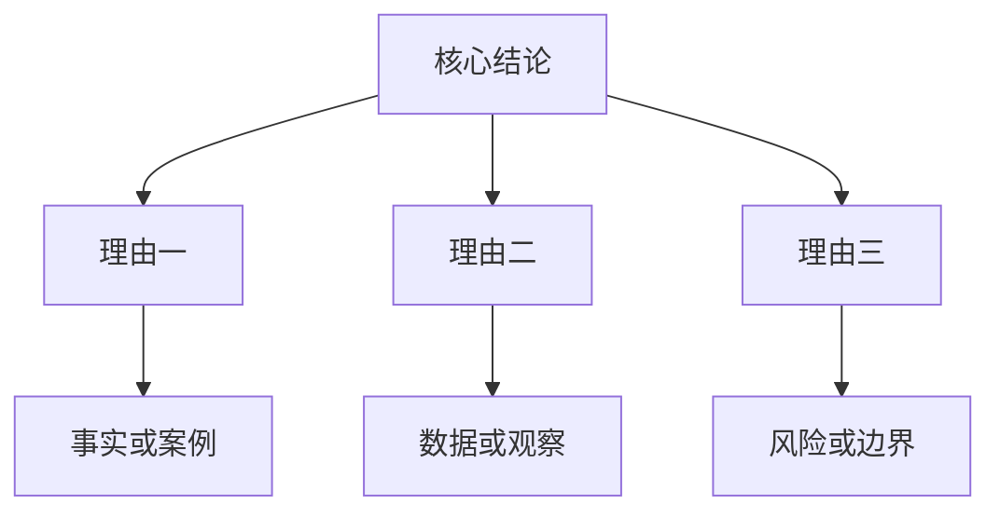

“先结论”常被误解成一种强势的表达姿态，好像只要一开口就把答案摆出来，就显得干练、果断、效率高。读《金字塔原理》时，我更愿意把它理解为一种对听者负责的结构安排：先给对方一个可以放置信息的位置，再展开论据、过程和细节。

很多表达之所以让人疲惫，不是内容没有价值，而是顺序只服从讲述者的思考轨迹。讲述者从材料、背景、过程、困难一路讲到结论，听者却必须在过程中不断猜测：“你到底想说明什么？”这时，沟通成本并没有消失，只是从说话的人转移到了听的人身上。

## 先结论不是先下判断

先结论并不等于不讲过程，也不是在证据不足时抢先表态。真正的先结论，是在完成必要思考之后，把已经整理好的判断放在前面。它背后的前提是：结论已经被论据支撑，论据之间可以相互区分，展开顺序经得起追问。

所以，先结论不是思考的捷径，而是表达的结果。一个人如果没有想清楚，就很难真正先结论；他最多只能先喊口号。结论越短，背后需要的整理工作反而越多。

## 表达顺序要服从听者任务

在工作场景里，听者通常不是来陪我们复盘心路历程的。他要判断风险、分配资源、做出决策，或者决定下一步行动。表达顺序如果不能帮助对方完成这些任务，就会变成信息堆积。

可以用一个简单表格判断表达重点：

| 场景 | 对方最需要什么 | 表达顺序 |
| --- | --- | --- |
| 请示决策 | 方案、取舍、风险 | 结论 -> 依据 -> 备选项 |
| 汇报进展 | 当前状态、阻塞点、下一步 | 结论 -> 变化 -> 需要支持 |
| 复盘问题 | 原因、责任边界、改进动作 | 结论 -> 证据 -> 机制改进 |
| 解释方案 | 目标、逻辑、实施路径 | 结论 -> 结构 -> 细节 |

如果对方最关心“该不该做”，就不要先讲“我们做过哪些准备”；如果对方最关心“风险在哪里”，就不要先讲“我们很重视”。表达不是把信息全部倒出来，而是按对方的判断路径重新排列。

## 金字塔结构的真正价值

金字塔结构的价值，不在于把文章写成几层标题，而在于建立一种可检验的关系：上层结论能否被下层论据支撑，下层论据之间是否同类、互斥、完整。

我理解的基本结构是：

这张图提醒我三件事。

第一，结论必须能被追问。别人问“为什么”，下面要有理由，而不是继续重复结论。

第二，理由之间要有清晰分工。三个理由如果都在表达同一个意思，就只是重复；如果彼此交叉，听者会分不清重点。

第三，细节要回到结论。不是所有材料都值得放进表达里，只有能支撑判断、解释差异、提示风险的材料才有位置。

## 练习方法

对我来说，最有效的练习不是背原则，而是改写日常表达。

把“我先介绍一下背景”改成：“我的判断是这件事可以推进，但需要先解决一个前置条件。”

把“我们最近做了几项工作”改成：“这周有一个实质进展、一个风险暴露、一个事项需要协调。”

把“这个问题比较复杂”改成：“复杂性主要来自三点：责任边界不清、数据口径不一致、时间窗口很紧。”

这样的改写，会逼迫自己先完成整理。表达能力表面上是语言能力，底层其实是分类、归因和取舍能力。

## 也要警惕“过度先结论”

先结论也有边界。面对探索性问题、情绪性沟通和需要共同生成答案的讨论，过早给出结论可能会压缩对话空间。尤其在团队讨论中，如果结论只是个人判断，还没有经过充分验证，就应该把语气放得更准确：这是初步判断，不是最终定论；这是推荐方案，不是唯一方案。

所以，“先结论”的关键不只是把答案放在前面，更是把确定性说准。确定的部分要明确，不确定的部分要标出来，需要对方决策的部分要单独提出。

读完这本书，我最大的收获不是学到一个表达套路，而是意识到：好的表达不是让自己说得顺，而是让别人更容易判断。先结论，是把整理成本留给自己，把理解入口交给对方。
