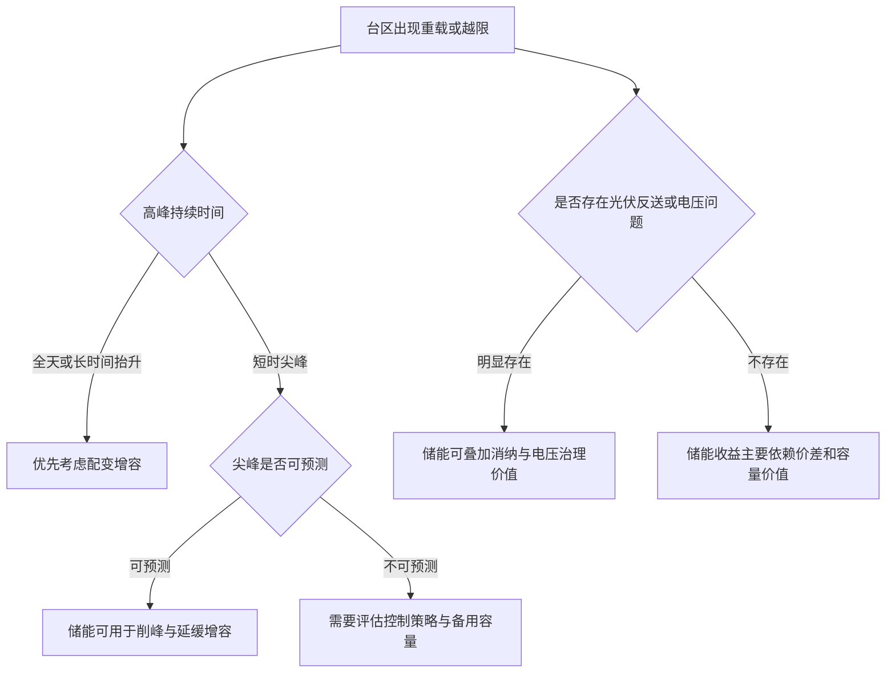

# 台区储能 vs 台区配变：造价、容量价值与经济性边界

讨论台区储能和台区配变，最容易落入一个简单比较：储能多少元/W，配变多少元/W，然后得出“储能比配变贵几倍”的结论。

这个结论并非没有意义，但它只回答了“单位功率造价谁更低”，没有回答真正决定项目成败的问题：负荷问题是什么类型，峰值持续多长时间，配变增容是否受到通道约束，储能能否被有效调用，收益是否可以结算，电池衰减和运维成本由谁承担。

更准确地说，台区储能和台区配变不是简单替代关系，而是两类不同性质的配网资源：

- **配变提供连续容量**，适合解决持续性、结构性负荷增长；
- **储能提供时移能力和快速调节能力**，适合解决短时峰值、光伏反送、电压质量、应急保供和源网荷储协同问题；
- **储能只有在多重价值能够叠加并被计量、调用、结算时，才可能具备经济性**。

本文的判断口径是“台区侧工程决策”，不是设备采购比价，也不替代具体项目可研。文中造价区间用于建立分析框架，实际项目应以最新询价、当地电价机制、接入条件和运行策略重新测算。

## 一、先校准比较口径

台区储能和台区配变表面上都可以写成 kW 级设备，但技术属性不同。

| 维度 | 台区配变 | 台区储能 |
| --- | --- | --- |
| 核心能力 | 持续输送容量 | 功率支撑 + 电量时移 |
| 标称单位 | kVA | kW / kWh |
| 作用时间 | 长时间连续运行 | 受储能时长约束，常见为 1-4 小时 |
| 寿命特征 | 20-30 年较常见 | 电池衰减明显，经济寿命常受循环次数和工况影响 |
| 成本结构 | 设备本体、土建、安装、线路改造 | 电池、PCS、BMS、EMS、消防、热管理、施工并网 |
| 主要风险 | 过载、损耗、建设周期、通道约束 | 衰减、安全、策略失效、调用不足、收益不确定 |
| 经济性来源 | 低成本扩容、可靠供电 | 削峰填谷、延缓投资、辅助服务、电能质量、光伏消纳 |

因此，单纯用“元/W”比较有两个问题。

第一，配变的 W 本质上是连续容量近似，储能的 W 只是功率能力，还必须同时看 kWh。200kW/400kWh 储能和 200kVA 配变并不等价，前者只能在一定时长内提供支撑，后者可以长期承载负荷。

第二，配变价值主要在“容量”，储能价值主要在“时间”。如果台区高峰只持续 30-90 分钟，储能可能有价值；如果负荷已经全天抬升，储能很难替代配变。

## 二、造价区间：配变便宜，但不是全部答案

以常见台区规模做粗略比较：

| 方案 | 典型配置 | 投资口径 | 估算区间 | 备注 |
| --- | --- | --- | --- | --- |
| 配变增容 | 200kVA 增至 400kVA 或新增 200kVA | 设备、安装、必要土建及配套 | 0.3-0.6 元/VA，复杂现场可能更高 | 若涉及线路、开关柜、土建改造，实际投资会明显上升 |
| 台区储能 | 200kW/400kWh | 电池、PCS、BMS、EMS、消防、热管理、施工并网 | 0.6-0.9 元/Wh，折合 1.2-1.8 元/W | 按 2 小时系统折算，时长越长，按 W 成本越高 |

从静态投资看，储能通常显著高于配变。若只解决“容量不够”这一件事，配变往往更经济。

但工程决策不能只看设备单价，还要看三个隐藏变量：

1. **增容是否容易实施**：如果新增配变受站址、线路通道、施工条件限制，储能的延缓投资价值会上升；
2. **高峰是否短时集中**：峰值持续时间越短，储能越可能用较小电量解决峰值问题；
3. **储能是否有其他收益**：若能叠加光伏消纳、需量管理、辅助服务、需求响应或容量补偿，储能才有经济性空间。

## 三、真正的分界线在负荷曲线

判断储能能否替代或延缓配变增容，不能只看最大负荷，要看负荷曲线。



一个简化判断是：

- **高峰持续时间小于储能可放电时长，且一年出现次数有限**：储能有机会延缓配变投资；
- **高峰持续时间超过储能时长，且负荷增长呈长期趋势**：配变增容更可靠；
- **台区同时存在分布式光伏反送、电压越限、短时重过载**：储能综合价值更高；
- **储能缺少可调用机制和收益结算机制**：即便技术上可行，商业上也可能不成立。

## 四、经济性模型：储能不能只靠峰谷套利

台区储能的年度净收益可以拆成：

```text
年度净收益 =
  峰谷套利收益
+ 延缓配变投资的容量价值
+ 光伏消纳或电能质量治理价值
+ 辅助服务、需求响应、容量补偿等市场收益
- 运维成本
- 衰减成本
- 保险、消防、检修和停运损失
```

其中，峰谷套利收益可用一个粗略公式估算：

```text
套利收益 = 放电电量 × 年循环次数 × 峰谷价差 × 综合效率
```

以 200kW/400kWh 储能、年循环 300 次、综合效率 90%、初始投资 60 万元为例，不考虑运维和衰减时：

| 峰谷价差 | 年套利收益 | 静态回收期 |
| --- | ---: | ---: |
| 0.3 元/kWh | 3.24 万元 | 18.5 年 |
| 0.5 元/kWh | 5.40 万元 | 11.1 年 |
| 0.7 元/kWh | 7.56 万元 | 7.9 年 |

这个表说明两件事。

第一，单靠峰谷套利非常脆弱。价差、循环次数、效率、可用率稍有变化，回收期就会明显拉长。

第二，即使价差较高，也不能忽略电池衰减、运维、消防、检修、停运和调度调用不足等成本。静态回收期看起来可接受，不代表全寿命周期净现值为正。

因此，台区储能的关键不是“有没有价差”，而是“有没有可被计量和结算的综合价值”。

## 五、四类典型场景判断

### 1. 纯扩容场景：配变优先

如果台区负荷持续增长，最大负荷长期逼近或超过配变容量，且新增配变和线路改造条件成熟，配变增容通常是更稳妥的方案。

此时储能的问题在于：它只能在有限时长内支撑负荷，无法改变基础负荷抬升的事实。若每天高峰持续 4-6 小时，而配置的是 2 小时储能，储能只能削掉一部分尖峰，不能替代连续容量。

**判断结论**：持续性容量不足，优先配变；储能最多作为过渡或辅助。

### 2. 短时尖峰场景：储能可作为延缓投资工具

如果台区只有少数时段出现尖峰，且尖峰持续时间短、可预测，储能可以在高峰期间放电，降低配变负载率。

这类场景要重点测算：

- 年度越限次数；
- 每次越限持续时间；
- 越限功率缺口；
- 储能放电后是否仍能满足安全裕度；
- 延缓配变投资的年限和资金时间价值。

**判断结论**：短时尖峰越集中、增容越受限，储能容量价值越高。

### 3. 分布式光伏高渗透场景：储能价值上升

在低压台区分布式光伏较多的区域，问题可能不是单向负荷增长，而是中午反送、傍晚负荷高峰、电压越限和台区功率双向波动。

此时储能可以承担三个角色：

- 中午吸收光伏出力，减少反向越限；
- 傍晚放电支撑负荷，降低配变峰值；
- 配合无功调节和电压控制，改善电能质量。

但这要求储能具备可靠的控制策略、数据采集和调度接口。没有可观、可测、可调、可控能力，储能很容易变成“装了但用不好”的资产。

**判断结论**：光伏反送、电压治理和削峰同时存在时，储能比单纯套利更有价值。

### 4. 应急保供和电能质量场景：看价值是否可定价

部分台区可能有重要用户、敏感负荷或保供需求，储能可提供短时备用、电压支撑和快速响应。但这类价值往往难以直接折算成现金收益。

如果项目由电网侧或公共服务侧主导，可以从可靠性、供电质量和社会效益评价；如果由投资方主导，则必须明确谁为这些价值付费。

**判断结论**：技术价值不等于商业价值，能否结算决定能否规模化。

## 六、决策矩阵

| 判断问题 | 更偏向配变 | 更偏向储能 |
| --- | --- | --- |
| 负荷增长形态 | 全天抬升、长期增长 | 短时尖峰、周期性波动 |
| 高峰持续时间 | 超过 4 小时 | 小于储能配置时长 |
| 增容条件 | 站址、通道、施工成熟 | 增容受限或周期较长 |
| 光伏接入 | 光伏少，反送不明显 | 光伏多，存在反送或电压问题 |
| 收益机制 | 主要追求可靠容量 | 可叠加套利、容量、辅助服务、需求响应 |
| 运维能力 | 常规运检能力即可 | 需要数据、策略、安全和消防闭环 |
| 投资目标 | 低成本解决容量问题 | 延缓投资并形成多元价值 |

## 七、给不同主体的建议

### 对电网企业

不要把台区储能简单作为配变增容的替代品，而应先建立台区问题分类机制。建议按“持续重载、短时尖峰、光伏反送、电压越限、重要负荷保供”分类建模，再决定技术路线。

对于储能试点，应同步配置运行评价指标，包括削峰贡献、等效利用小时、可用率、响应精度、告警有效性、隐患闭环率和收益偏差。

### 对投资方

纯套利项目要谨慎。台区储能投资小而分散，单站运维成本和管理成本不容忽视。如果没有明确的调用机制、结算机制和资产运营能力，账面收益很容易高估。

投资测算应至少做三组敏感性分析：峰谷价差、年循环次数、电池衰减。任何一个变量恶化，都可能改变项目结论。

### 对设备商和服务商

不能只卖设备，要把“储能 + 控制策略 + 数据平台 + 安全运维 + 收益复盘”作为整体方案。台区储能的竞争重点不是单个电池舱，而是能否长期证明它解决了台区问题。

## 八、政策和行业背景

国家层面对新型储能的定位已经从示范建设转向规模化、高质量、市场化应用。国家能源局介绍，截至 2025 年底，全国已建成投运新型储能装机规模达到 1.36 亿千瓦/3.51 亿千瓦时，平均储能时长 2.58 小时。规模快速增长之后，行业重点会从“装机多少”转向“是否安全、是否可调、是否有收益、是否能支撑新型电力系统”。

同时，新能源上网电价市场化改革推动新能源电量进入电力市场，上网电价通过市场交易形成，并建立可持续发展价格结算机制。需要注意，这并不等于用户侧分时电价简单“取消”，但它意味着储能收益越来越依赖市场机制、调用规则和结算方式，单纯依靠固定价差的模式会更脆弱。

## 九、结论

台区配变和台区储能的选择，不是“谁更先进”的问题，而是“台区到底缺什么能力”的问题。

如果缺的是连续容量，配变是基础答案；如果缺的是短时调节、时移、电压支撑和源网荷储协同能力，储能才有发挥空间。储能经济性成立的前提，不是把设备造价算低一点，而是把可调用、可计量、可结算的综合价值做实。

一句话概括：**配变解决容量底座，储能解决时间和调节；前者靠低成本可靠扩容取胜，后者靠多重价值闭环成立。**

## 参考来源

- [国家能源局：2025 年新型储能发展情况](https://www.nea.gov.cn/20260130/50f657ce87f848e1a9a1861d1fd9aa23/c.html)
- [国家发展改革委、国家能源局：关于深化新能源上网电价市场化改革促进新能源高质量发展的通知](https://www.ndrc.gov.cn/xxgk/zcfb/tz/202502/t20250209_1396066.html)
- [国家能源局有关负责同志就《新型储能规模化建设专项行动方案（2025-2027年）》答记者问](https://www.nea.gov.cn/20250912/24589b84cb0d4120b263106e3e7c50d1/c.html)
- [国家发展改革委、国家能源局、国家数据局：加快构建新型电力系统行动方案（2024-2027年）](https://www.ndrc.gov.cn/xxgk/zcfb/tz/202408/t20240806_1392258_ext.html)

**标签**: #储能 #配电网 #造价分析 #台区储能 #配电变压器 #电力市场 #经济性分析
